# **AI 기반 피부 질환 조기 진단** 

## **목차**

- 문제 배경
    - 프로젝트 목표

- DATA 소개
    - Skin Disease Dataset
    - Skin Cancer: Malignant vs. Benign
- EDA

- MODEL
    - TOP 1-3
    - 세부 분석
    - TOP 4-6
    - 오분류 시각화

- 성능 개선
    - CNN 고도화
    - 데이터 증강
    - 데이터 보강
    - 가중치 적용

- 통합 성능 평가

- Sub Mission
    - Roboflow
    - MODEL 학습
    - 평가
    - 문제 해결
- 결론


# **문제 배경**

최근 **환경오면 심화**로 인체 건강, 특히 피부 질환 발생률이 지속적으로 증가

오존(O3), 미세먼지, 자외선 등 환경 요인이 피부에 직접적 손상을 유발

장기 노출 시, 여드름, 피부염, 피부암 등 다양한 피부 질환 발병 위험 상승

현재 피부과 진료 대기 시간 장기화(최소 1달/최대 6개월)로 인해 흑생종, 피부암, 중증여드름 등 심각한 문제를 끼칠 수 있는 피부병을 조기에 치료할 수 없을 수 있다.

자가 촬영 -> AI 1차 판별 하는 시스템을 구축하여

보건소 및 약국에 배치하여 우선 진단권을 확보하여 조기 치료율 향상을 기대 할 수 있다.

## **프로젝트 목표**

| ```핵심 목표``` |
|-|
| 피부질환 이미지 데이터를 활용하여 정상 피부 VS 질환별 분류 모델 개발 → 자가 촬영 이미지를 통한 피부 질환 판별 |
|```후속 연구 방향```|
 질환 예측 결과를 인종별, 국가별, 환경 요인별로 연계 분석 |


# **DATA**

Kaggle
1. [Skin Disease Dataset](https://www.kaggle.com/datasets/pacificrm/skindiseasedataset)
    - 22개의 피부 질환 항목으로 구성
    - **15,400개**의 이미지
    - 형식 : **~.jpeg**
2. [Skin Cancer: Malignant vs. Benign](https://www.kaggle.com/datasets/fanconic/skin-cancer-malignant-vs-benign)
    - 피부암으로 발전할 수 있는 악성 점과 양성 점을 구분해 놓은 데이터
    - **3,297개**의 이미지
    - 형식 : **~.jpg**


# **EDA**
22개 항목중 환경요인에 따른 피부 질환 위험도 상위 6종만 구성

3개씩 나눠서 테스트 진행

|영문 진당명|한국어 의미|환경적 악화 요인|
|---------|----------|--------------|
| Eczema | 습진 | 미세먼지, SO2, CO |
| Psoriasis | 건선 | 미세먼지|
| Acne | 여드름 | 미세먼지 |
| Rosacea | 주사 | 미세먼지 |
| Skin Cancer | 피부암 | UVB, 오존층 파괴 |
| Sun/Sunlight Damage | 햇빛 손상 | UVB/UVA |

## TOP 1-3

| 클래스 | 데이터 양 |
|-|-|
|Acne(**여드름**)|593개|
|Eczema(**습진**)|1,010개|
|Psoriasis(**건선**)|820개|

- 데이터 불균형확인

## TOP 4-6

| 클래스 | 데이터 양 |
|-|-|
|Rosacea (**주사**)|254개|
|Skin Cancer (**피부암**) |693개|
|Sun/Sunlight Damage (**햇빛 손상**)|312개|

- 데이터 불균형확인

# **MODEL**

- 경량 CNN 베이스라인으로 가볍게 시작 
```python
=====================================================================================
Layer (type (var_name):depth-idx)        Kernel Shape    Output Shape    Param #
=====================================================================================
CNN (CNN)                                --              [1, 3]          --
├─Conv2d (conv1): 1-1                    [3, 3]          [1, 32, 224, 224] 896
├─Conv2d (conv2): 1-2                    [3, 3]          [1, 64, 112, 112] 18,496
├─Conv2d (conv3): 1-3                    [3, 3]          [1, 128, 56, 56] 73,856
├─Dropout (dropout): 1-4                 --              [1, 128, 28, 28] --
├─Linear (fc1): 1-5                      --              [1, 512]        51,380,736
├─Linear (fc2): 1-6                      --              [1, 3]          1,539
=====================================================================================
Total params: 51,475,523
Trainable params: 51,475,523
Non-trainable params: 0
Total mult-adds (M): 559.97
=====================================================================================
Input size (MB): 0.60
Forward/backward pass size (MB): 22.48
Params size (MB): 205.90
Estimated Total Size (MB): 228.99
=====================================================================================
```


## **TOP 1-3**


|클래스|구분|총 이미지 수| 오답 수 | 정확도 | 
|-----|---|-----------| ------ | ----- | 
|여드름 (Acne)|0|   65    |    16     | **75%** | 
|습진 (Eczema)| 1|  112    |    26     | **76%** | 
|건선 (Psoriasis)|2|   88   |    48     | **45%** | 

- Train data : 2,423
- Test data : 265

**과적합 의심**
```
*why?* 
-
1. 데이터 불균형?
2. 모델의 단순성?
3. 너무 과한 Epoch?
```
## **세부 분석**
### **1. 여드름 (Acne)**

<p align='left'>
    
    
</p>

### 결과

| 구분 | 내용 |
|------|------|
| 총 이미지 | **65장** |
| 오답 | **23건** |
| 정확도 | **64%** |

| 잘못 예측된 클래스 | 횟수 |
|-------------------|------|
|  습진 (Eczema) | **9회** |
|  건선 (Psoriasis) | **14회** |


- 가설
    1. 시각적 유사성 : 여드름, 습진, 건선 모두 붉은 색 발진/ 염증 이라는 공통 특징 보유
    2. 부위별 특징 차이 : 얼굴보다는 몸에 발생한 여드름에서 분류 정확도가 상대적으로 높음

- 분석 결과
    1. 몸 전체 사진 비중이 상대적으로 많지만, 심각한 수준의 불균형은 아님
        - 몸, 얼굴 전체, 부분 클로즈업 → 4 : 3 : 3 정도의 비율

### 2. 습진 (Eczema)
<p align='left'>
    
    
</p>

### 결과

| 구분 | 내용 |
|------|------|
| 총 이미지 | **112장** |
| 오답 | **36건** |
| 정확도 | **67%** |

| 잘못 예측된 클래스 | 횟수 |
|-------------------|------|
|  여드름(Acne) | **6회** |
|  건선 (Psoriasis) | **30회** |


- 가설 및 결과
    1. 공통 특징 : 볽은색 발진이 넓게 퍼진 형태
    2. 혼동 요인 : 건선과 습진의 경우 발진 형태가 유사하다

### 3. 건선 (Psoriasis)

<p align='left'>
    
    
</p>

### 결과

| 구분 | 내용 |
|------|------|
| 총 이미지 | **88장** |
| 오답 | **35건** |
| 정확도 | **60%** |

| 잘못 예측된 클래스 | 횟수 |
|-------------------|------|
|  여드름(Acne) | **8회** |
|  습진(Eczema) | **27회** |


- 가설 및 결과
    1. 공통 특징 : 볽은색 발진이 넓게 퍼진 형태
    2. 혼동 요인 : 건선과 습진의 경우 발진 형태가 유사하다
        - 다만 건선의 경우 일부는 하얀 각질이 동반되지만, 없는 경우도 있어 분류 어려움 있엇을 것이라고 생각됨
    3. 데이터 양 : 습진 데이터가 더 많아 습진으로 잘못분류된 경우 다수(데이터 불균형)


## **TOP 4-6** (Epoch 를 5로 줄여서 시험 )

<p align='left'>
    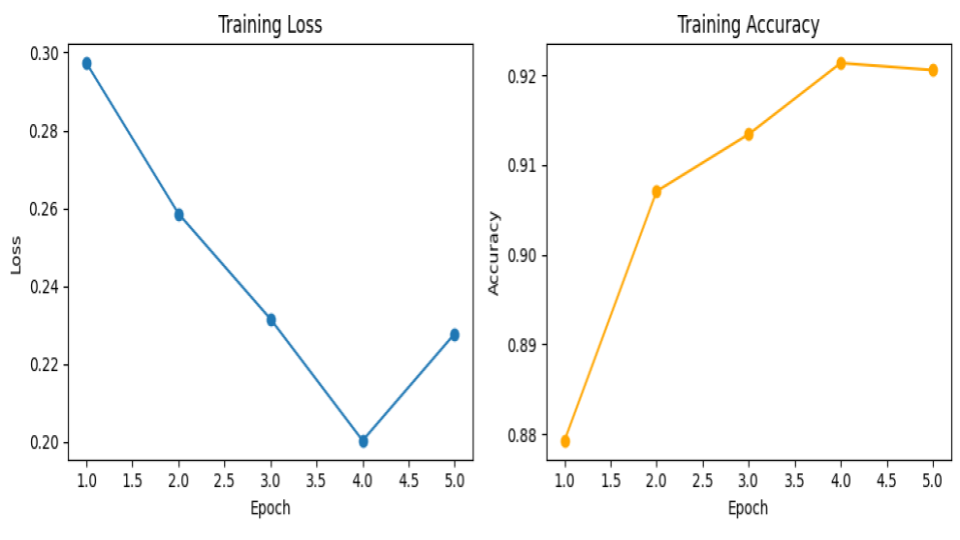
</p>

- Train data : 1,259

- Test data : 139


약간의 과적합 가능성 확인

<p align='left'>
    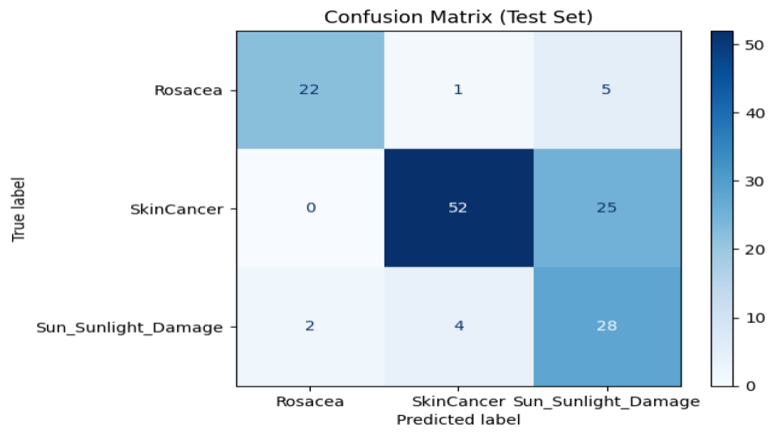
</p>

|클래스|총 이미지 수| Precision | Recal | F1-score ||
|-----|-----------| ------ | ----- | ----- |-----|
|Rosacea (주사*)|   254    |    0.92     | 0.79 | 0.84 |22개 정답, 6개 오분류 → 정확도 높은 편|
|Skin Cancer (피부암) |   693    |    0.91     | 0.68 | 0.78 |52개 정답, 25개를 Sun Damage로 혼동|
|Sun/Sunlight Damage (햇빛 손상)|   312   |    0.48     | 0.82 | 0.61 |28개 정답, 6개 오분류 → 무난하지만 일부 혼동|


**오분류 시각화**
-
| 클래스 | 오분류 개수 |
|---------|-------------|
|  주사 (Rosacea) | 6 |
|  피부암 (Skin Cancer) | **25** |
|  햇빛 손상 (Sun_Sunlight_Damage) | 6 |

- 피부암 에서 오분류가 압도적으로 많음
```
*WHY??*
-
1. 패턴의 다양성 부족 : 패턴의 다양성이 부족해 Recall 성능 떨어짐
2. 패턴의 유사성 : 병변 부위의 주요 특징이 일치하는 경우가 있음
```
- **예시**
<p align='left'>
    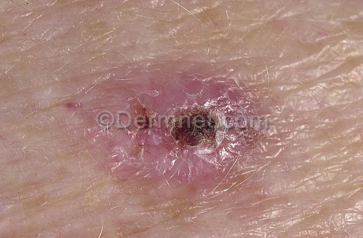  →피부암
    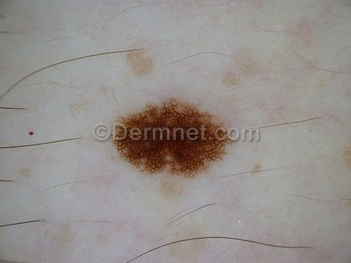 → 햇빛 화상
</p>
피부암의 가장 큰 특징은 붉은 발진위에 검은 점이 있다는 특징이 있다. 하지만 햇빛 손상에도 검은색으로 이루어진 병변이 몇 있다. 모델이 이 부분에 학습이 부족한 것으로 보임


# **성능 개선**

- TOP 1-3 : CNN 고도화 & 데이터 증강

- TOP 4_6 : 데이터 보강 & 클래스 가중치 적용

## **TOP 1 - 3**
**1. CNN 고도화**
-
```python
==========================================================================================
Layer (type:depth-idx)                   Output Shape              Param #
==========================================================================================
CNN                                      [1, 3]                    --
├─Conv2d: 1-1                            [1, 64, 128, 128]         1,792
├─Conv2d: 1-2                            [1, 64, 128, 128]         36,928
├─MaxPool2d: 1-3                         [1, 64, 64, 64]           --
├─Conv2d: 1-4                            [1, 128, 64, 64]          32,896
├─Conv2d: 1-5                            [1, 128, 64, 64]          65,664
├─MaxPool2d: 1-6                         [1, 128, 32, 32]          --
├─Conv2d: 1-7                            [1, 256, 32, 32]          131,328
├─Conv2d: 1-8                            [1, 256, 32, 32]          262,400
├─MaxPool2d: 1-9                         [1, 256, 16, 16]          --
├─Conv2d: 1-10                           [1, 512, 16, 16]          524,800
├─Conv2d: 1-11                           [1, 512, 16, 16]          1,049,088
├─MaxPool2d: 1-12                        [1, 512, 8, 8]            --
├─Linear: 1-13                           [1, 256]                  8,388,864
├─Dropout: 1-14                          [1, 256]                  --
├─Linear: 1-15                           [1, 128]                  32,896
├─Dropout: 1-16                          [1, 128]                  --
├─Linear: 1-17                           [1, 64]                   8,256
├─Dropout: 1-18                          [1, 64]                   --
├─Linear: 1-19                           [1, 3]                    195
==========================================================================================
Total params: 10,535,107
...
Input size (MB): 0.20
Forward/backward pass size (MB): 31.46
Params size (MB): 42.14
Estimated Total Size (MB): 73.80
==========================================================================================
```

<p align='left'>
    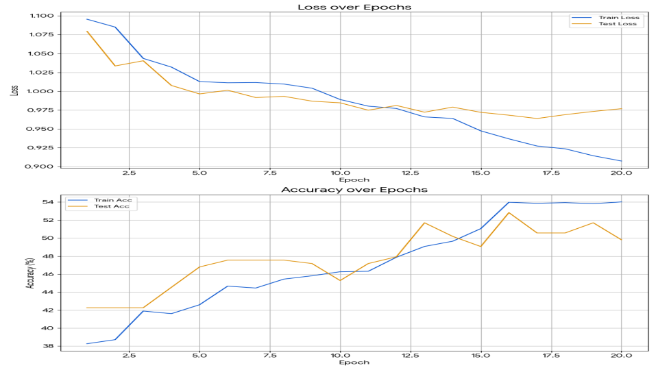 
</p>

| 구분 | 수치 |
|-----|------|
|Train Acc|0.9074|
|Train Loss|54.02%|
|Test  Loss|0.9768|
|Test  Loss|49.81%|

- 단순히 모델을 복잡하게 한다고 해서 과적합 문제가 해결되는 것은 아님 → 데이터 중심 접근이 우선 필요하다고 판단.


**2. 데이터 증강**
- 

<p align='left'>
    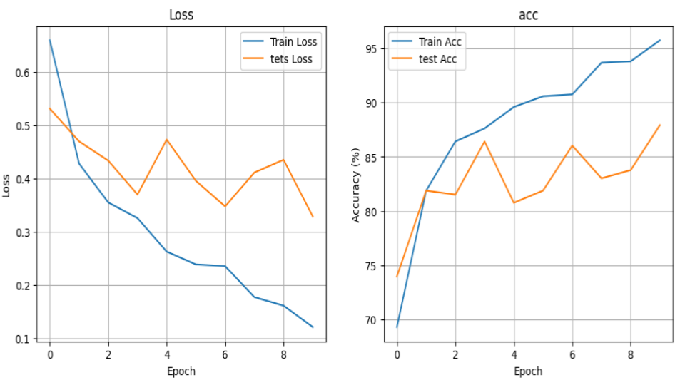 
</p>

| 구분 | 수치 |
|-----|------|
|Train Loss|0.1216|
|Train Acc| 95.75%|
|Test  Loss|0.3289|
|Test  Acc|87.92%|

1. Epoch 20 -> **10으로 축소** , 과적합 위험 완화
2. 증강 적영후 안정적 성능 보임
3. 살짝 위태로운 부분이 있으나, **증강 효과 뚜렷**


**성능 개선 결과**
-
| 클래스 | 총 이미지 수 | 오답 수 | 정확도 |
|-------|------------|--------|--------|
| 여드름 (Acne) | 65 | 7 | 89.23% |
| 습진 (Eczema) | 112 | 17 | 84.82% |
| 건선 (Psoriasis) | 88 | 8 | 90.91% |

- **오답 예측**
    - 여드름    
        - 습진 : 3
        - 건선 : 4
    - 습진
        - 여드름 : 2
        - 건선 : 15
    - 건선
        - 여드름 : 0
        - 습진 : 8

- 여드름 : 비교적 잘 구분됨, 정확도 안정적
- 습진 VS 건선 : 시각적 특징이 유사해 **서로 혼동**되는 경우 다수 발생, 특히 붉은 발진 패턴이 겹치고, 건선은 흰 각질 유무에 따라 구분 난이도 차이가 분명

## **TOP 4 - 6**
**1. 데이터 보강**
-
- SkinCancer(피부암) 데이터 5,000장 데이터 추가 활용
    1. 기존 클래스 그대로 두고, 피부암 데이터 추가 후 학습 → Recall 상승 확인

<p align='left'>
    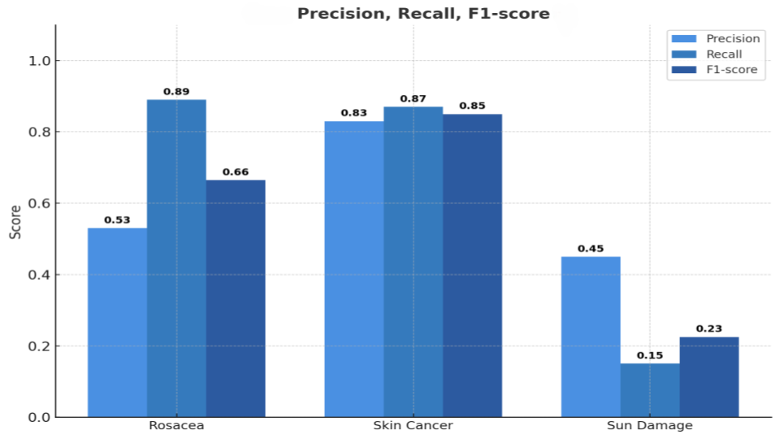 
</p>

|클래스| Precision | Recal | F1-score ||
|-----| ------ | ----- | ----- |-----|
|Rosacea (주사*)|     0.53     | 0.89 | 0.66 |잘 잡아내지만 다른 클래스(특히 Sun Damage)를 과잉 탐지→ Recall ↑ / Precision ↓|
|Skin Cancer (피부암) |     0.83     | 0.87 | 0.85 |성능 안정적, Precision·Recall 균형적 → 5,000장 증강 효과 뚜렷|
|Sun/Sunlight Damage (햇빛 손상)|    0.45     | 0.15 | 0.23 |성능 매우 낮음, 대부분 Rosacea·Skin Cancer로 혼동 → 데이터 부족 & 시각적 유사성 문제|

→ Skin Cancer는 안정화 성공, 그러나 5,000장이 추가되면서 데이터 불균형심해짐

**2. 가중치 적용**
-
불균형 보정을 위해 CrossEntropyLoss(손실함수)에 클래스 가중치 반영

|클래스|가중치||
|-----|-----|-|
|Rosacea (주사*)|1.65|데이터 적음 → Loss 크게 반영 |
|Skin Cancer (피부암)|0.61|데이터 가장 많음 → Loss 작게 반영 |
|Sun/Sunlight Damage (햇빛 손상)|1.35|중간 수준, 보정 필요|


<p align='left'>
    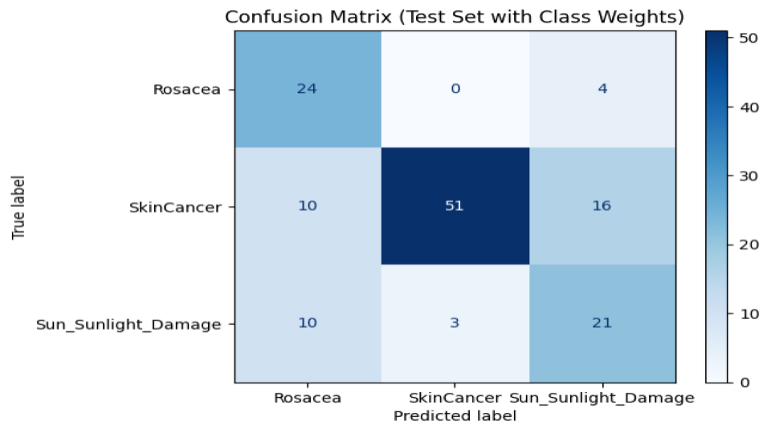 
</p>

|클래스| Precision | Recal | F1-score ||
|-----| ------ | ----- | ----- |-----|
|Rosacea (주사*)|     0.55     | 0.86 | 0.67 |Recall ↑, Precision ↓ → 잘 잡지만 FP 많음 (과잉 탐지)|
|Skin Cancer (피부암) |     0.94     | 0.66 | 0.78 |Precision ↑, Recall ↓ → 놓침 존재 (데이터 불균형·가중치 영향)|
|Sun/Sunlight Damage (햇빛 손상)|    0.51     | 0.62 | 0.56 |Recall 크게 개선됨 → 과소탐지 완화|


**성능 개선 결과**
-
| 클래스 | 총 이미지 수 | 오답 수 | 정확도 |
|-------|------------|--------|--------|
| Rosacea (주사*) | 28 | 4| 85.71% |
| Skin Cancer (피부암) | 77 | 26 | 66.23% |
| Sun/Sunlight Damage (햇빛 손상)| 34 | 13| 61.76% |

- 오답 
    - Rosacea (주사*)
        - 피부암 : 0
        - 햇빛 손상 : 4
    - Skin Cancer (피부암)
        - 주사* : 10
        - 햇빛 손상 : 16
    - Sun/Sunlight Damage (햇빛 손상)
        - 주사* : 10
        - 피부암 : 21

- acc 는 감소했지만 Precision/ Recall 수치 개선, 피부암을 더 잘 구분 가능
- 모델이 특정 클래스에 치우치치 않고 균형잡힌 부류를 하게됨


# **통합 성능 평가**

TOP 1-6 외 4개의 클래스를 추가해 통합 성능평가 진행

<p align='left'>
    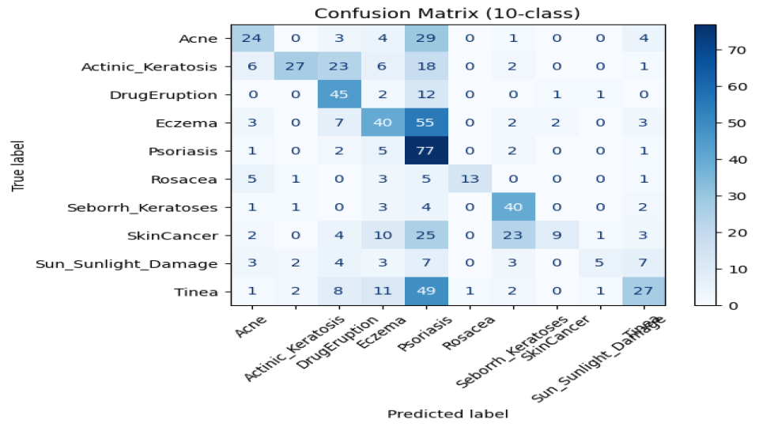 
</p>

| 클래스 | Precision | Recall | F1-score | 해석 |
|---------|------------|--------|-----------|------|
| Acne | 0.74 | 0.45 | 0.56 | 예측 정확도는 괜찮지만 실제 사례를 많이 놓침 |
| Actinic_Keratosis | 0.73 | 0.46 | 0.56 | Acne와 비슷하게 Recall 낮음 → 놓치는 경우 많음 |
| DrugEruption | 0.53 | 0.69 | 0.60 | Recall 높음, Precision 낮음 → 다른 클래스도 끌어옴 |
| Eczema | 0.41 | 0.77 | 0.53 | 실제 사례는 잘 잡지만 오분류 많음 (과탐지) |
| Psoriasis | 0.57 | 0.32 | 0.41 | 전반적으로 성능 낮음 → 데이터 보강 필요 |
| Rosacea | 0.92 | 0.43 | 0.59 | Precision 매우 높음, Recall 낮음 → 놓치는 경우 있음 |
| Seborrh_Keratoses | 0.45 | 0.90 | 0.60 | Recall 높음, Precision 낮음 → 다른 클래스가 많이 들어옴 |
| SkinCancer | 0.47 | 0.47 | 0.47 | 전반적으로 낮음, 가장 분류 어려움 |
| Sun_Sunlight_Damage | 0.69 | 0.26 | 0.38 | Recall 낮음 → 데이터 부족, 혼동 심함 |
| Tinea | 0.69 | 0.46 | 0.55 | Acne, Actinic_Keratosis와 비슷하게 Recall 낮음 |

ACC : 53.2 %

Macro F1 : 0.53

Weight F1 : 0.52

- 강점 : Rosacea(Precision), Eczema·Seborrh_Keratoses(Recall)
- 약점 : Psoriasis, Sun_Sunlight_Damage → 데이터 부족 & 낮은 성능
- **개선 포인트** : Recall 낮은 클래스(놓치는 질환) 중심으로 데이터 보강 + 클래스 가중치 적용

**개선 후**
-
<p align='left'>
    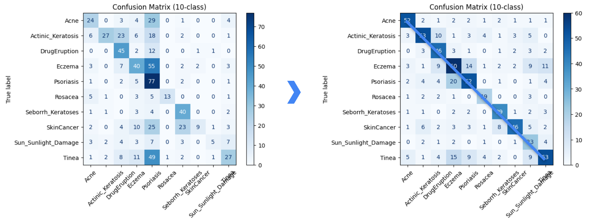 
</p>

| 클래스                 | 총 이미지 | 정확도(%) | 오답 수 | 주요 혼동 클래스                                  |
| ------------------- | ----- | ------ | ---- | ------------------------------------------ |
| Acne                | 65    | 80.00  | 13   | Actinic_Keratosis(2), Eczema(2)            |
| Actinic_Keratosis   | 83    | 63.86  | 30   | DrugEruption(10), SunDamage(5)             |
| DrugEruption        | 61    | 75.41  | 15   | Actinic_Keratosis(3), Eczema(3)            |
| Eczema              | 112   | 53.57  | 52   | Psoriasis(14), Tinea(11)                   |
| Psoriasis           | 88    | 59.09  | 36   | Eczema(20), Actinic_Keratosis(4)           |
| Rosacea             | 28    | 67.86  | 9    | SunDamage(3), Actinic_Keratosis(2)         |
| Seborrh_Keratoses   | 51    | 76.47  | 12   | Tinea(3), Eczema(2)                        |
| SkinCancer          | 77    | 59.74  | 31   | Seborrh_Keratoses(8), Actinic_Keratosis(6) |
| Sun_Sunlight_Damage | 34    | 67.65  | 11   | Tinea(4), Actinic_Keratosis(2)             |
| Tinea               | 102   | 51.96  | 49   | Eczema(15), Psoriasis(9)                   |

ACC : 63.2 %

Macro F1 : 0.63

Weight F1 : 0.63

**최종 결과**
-
- CNN 고도화와 가중치를 조절 하며 데이터 증강하니 의미 있는 성능 상승
- 모델 강점, 약점
    - 강점 : Acne, Seborrh_Keratoses, DrugEruption에서 안정적 예측
    - 약점 : 피부염 계열 혼동, SkinCancer–Keratosis: 구분 난이도 존재


# **Sub Mission**

- 세그멘테이션 모델링을 통해 피부암 악성, 양성 구분

- 피부과 전문의도 육안만으로는 양성, 악성 판별 어려움 → 시각적 유사성으로 혼돈 잦음

## 라벨링
- 사용 도구
    - Roboflow - polygon tool
- 데이터 
    - [Skin Cancer: Malignant vs. Benign](https://www.kaggle.com/datasets/fanconic/skin-cancer-malignant-vs-benign)

<p align='left'>
    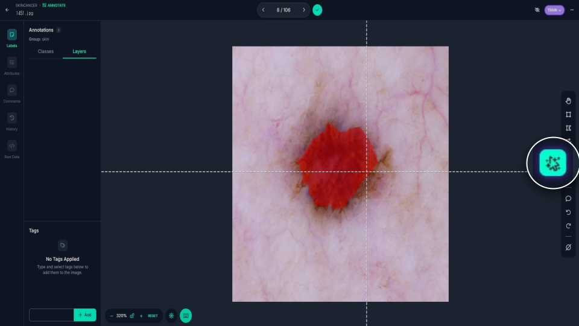 
</p>

악성 100장 / 양성 100장 총 200장 손으로 직접 라벨링

- 주의 사항
    - Polygon을 널널하게 할껀지 타이트하게 할건지 모두 통일

## **특이 사항**

**라벨링 과정중 학습에 방해될 수 있는 요소 발견**

**1. 악성 이미지**
-
<p align='left'>
    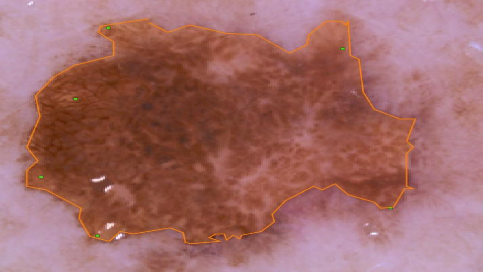 
</p>

병변 경계가 불분명하여서 외각선 따기가 어려움 


**2. 악성 이미지**
-
<p align='left'>
    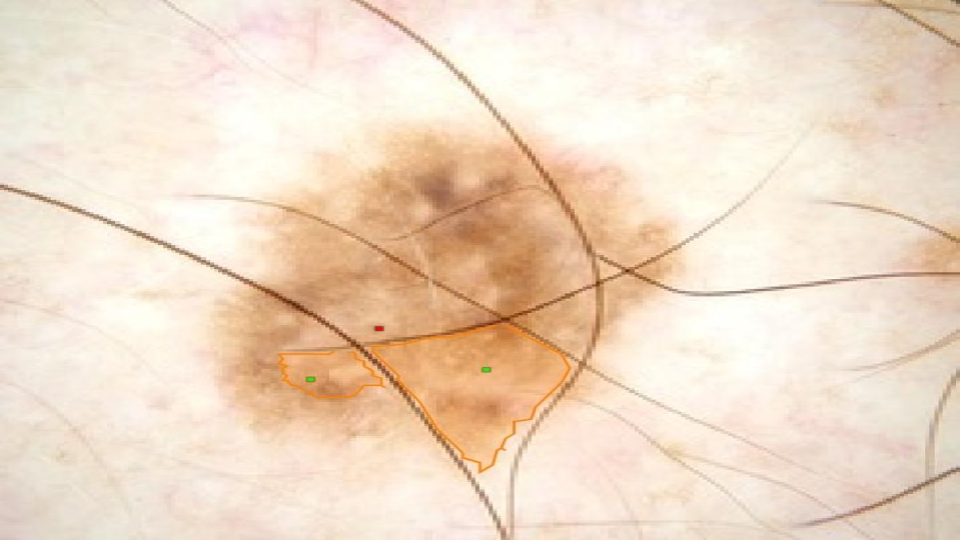 
</p>

체모가 병변 부위 를 지나가거나 일부 가림 


**3. 양성 이미지**
-
<p align='left'>
    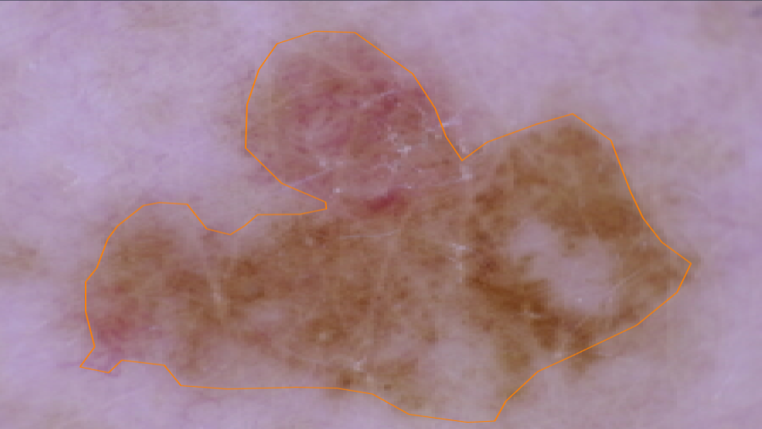 
</p>

두가지 색상으로 존재(소수 존재)

## **모델 학습**

- MODEL : MultiTaskDeepLab(DeepLabV3 - ResNet50)

    - Segmentation 클래스: 0: background, 1: benign, 2: malignant

    - Classification 출력: benign, malignant


<p align='left'>
    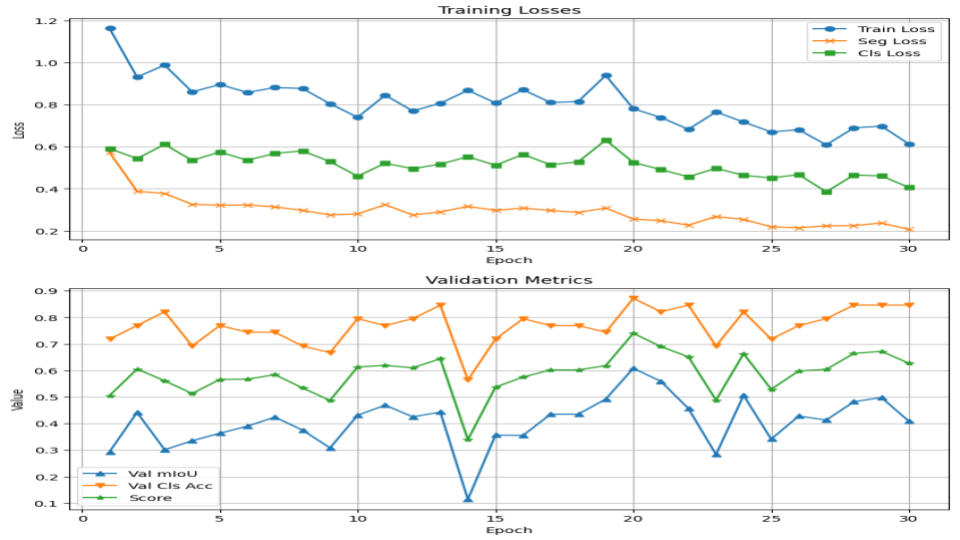 
</p>

|Train Loss|Seg Loss|Cls Loss|Val mloU|Val Cls Acc|
|----------|--------|--------|--------|-----------|
|0.61|0.21|0.41|0.41|0.86|

- loss 감소폭은 적지만 꾸준히 감소

### 간단 평가

<p align='left'>
    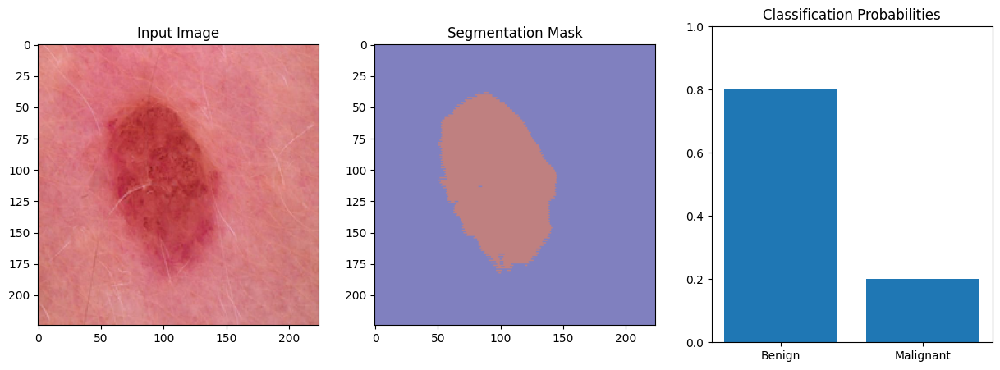 
</p>

양성 사진을 넣어봤을때 양성이라고 잘 예측하고 병변부위까지 잘찾아주는 모습을 보여준다

**평가**
-
- Test data : [ISIC(International Skin Imaging Collaboration)](https://www.isic-archive.com/)
    - 379 장
    - 주석이 달린 피부 병변 이미지 데이터셋 활용
    - 악성 및 양성 피부 병변 이미지가 혼합

- TEST Data 성능 평가

    - Loss : 3.79
    - acc : 72%

우려했던 결과 도출 : 체모가 있는 사진은 잘 예측 하지 못한다.
<p align='left'>
    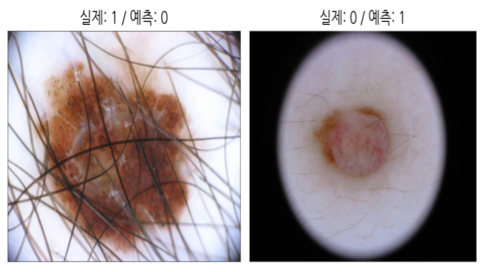 
</p>

```python
why??

1. 데이터 부족?
2. polygon 디테일 부족?
```

**문제 해결 해보기**
-
1. 각 400장씩 추가 라벨링 → 총 2,000장
2. polygon 타이트하게 진행(기존 사진도 수정)

EX)
<p align='left'>
    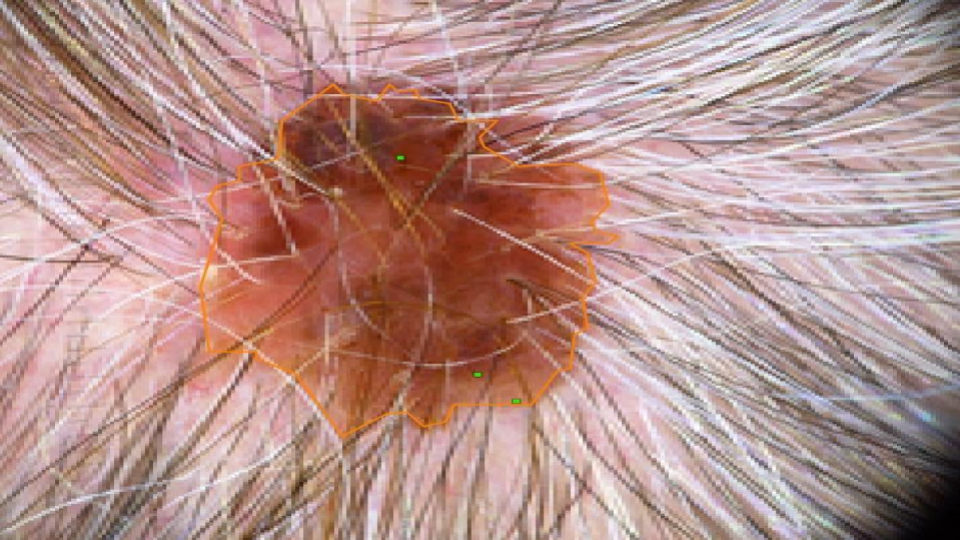 
</p>


- **수정 후 모델 성능**

    - Loss: 0.60
    - Accuracy: 80.39%

<p align='left'>
    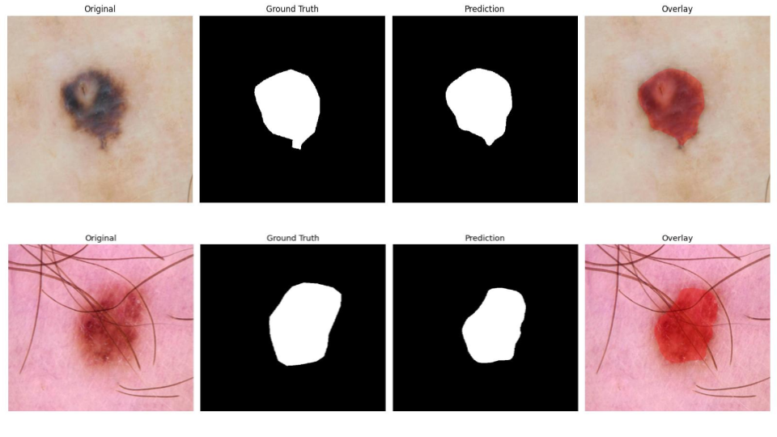 
</p>

**관찰된 개선점**
- 체모가 있어도 병변 영역을 잘 탐지

**2차 평가**
-

<p align='left'>
    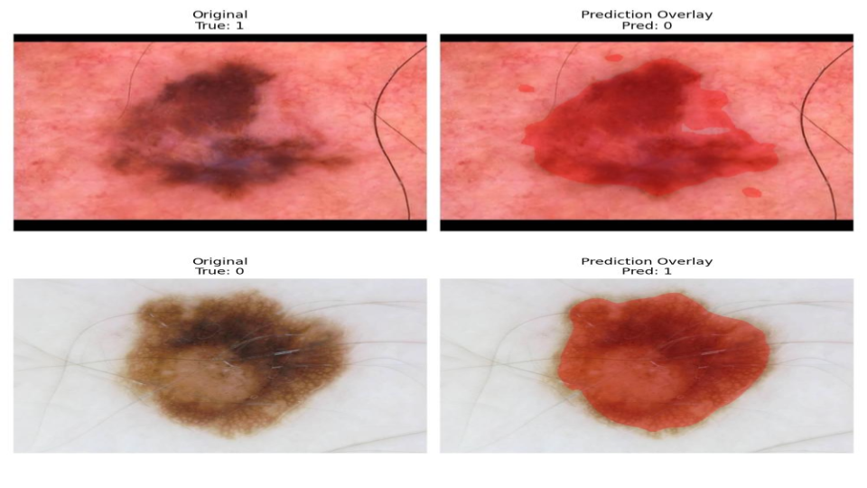 
</p>

- TEST Data 성능 평가

    - Loss : 1.55

    - acc : 46%

- **오분류 비율**

    - 악성 → 양성 : 48%

    - 양성 → 악성 : 52%

**특이 사항**
1. 체모가 있더라도 병변 부위 탐지 양호
2. loss 감속
3. 하지만 acc 낮아짐

**모델이 잘 찾지 못한경우**
-
**1. 병변이 두 가지 색상으로 섞여 있는 경우**
<p align='left'>
     
</p>


**2. 체모가 병변 특성을 가려 특징 왜곡 발생한 경우**
<p align='left'>
     
</p>

→ segment 는 잘 찾지만 classification 에서 오류 발생

**예측 오류 인사이트**
-
- 색상/패턴의 유사성
    - 악성처럼 두 가지 색상이 섞여 있거나 어두운 경계패턴 → 악성 오분류  
    - 피부색과 병변색이 비슷하면 경계 넓게 잡는 경향 발생

- 체모(Body hair) 영향
    - 털이 많이 있는 경우, 마스크가 병변과 털을 함께 포함 그로 인해 부분은 잘 잡아도 분류는 혼동

- 경계 불분명한 병변
    - 퍼져있는 형태의 병변은 마스킹 과대 추출됨
    - True label: benign →  malignant 특성과 유사하다고 학습


- 데이터 불균형 영향
    - 양성 데이터 중 특이한패턴(색, 질감)을 가진 이미지가 적어 오분류 가능 


# 결론 및 성과

## 성과
1. 10클래스 통합 분류 모델 학습완료, 특정 질환의 예측 정확도 높음
2. 악성 병변 영역 세그멘테이션 모델 적용 → 조기 진단 보조 가능성 확인.


## 보안점
1. CNN 모델 최적화를 통해 더 좋은 모델 학습 효과 기대 할 수 있음
2. 더 다양하고 많은 이미지를 학습 시키면 좋은 성능 기대 할 수 있음
3. 라벨링 수준(타이트 or 널널하게)을 좀더 통일시키면 더 좋은 acc 기대할 수 있을것이다.

## 배운점 
1. 다중 클래스를 다루는 스킬 습득
2. Roboflow 사용법 숙지
3. MultiTaskDeepLab(DeepLabV3 - ResNet50) 모델에관하여 학습
4. 오류 분석 능력 향상
    - 모델의 구성보다는 이미지 양, 품질이 중요하다는 점 숙지
5. CNN 코드 구성 능력 향상
6. torch 스킬 향상
